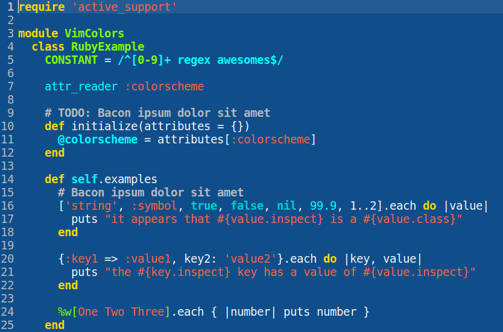
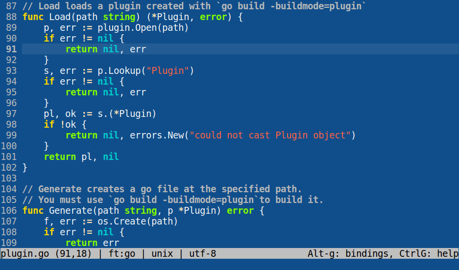
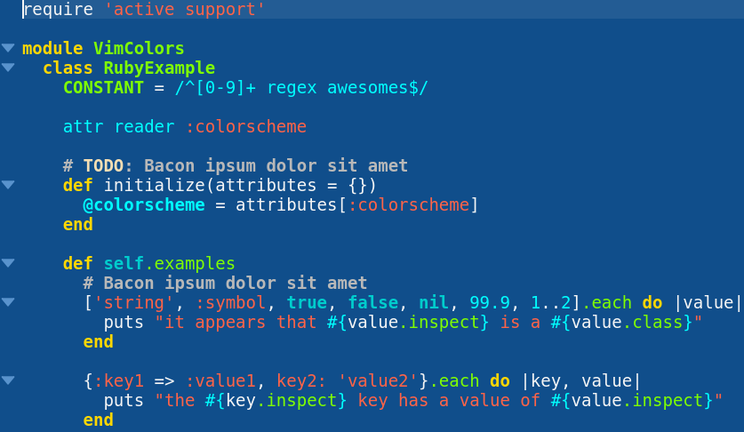
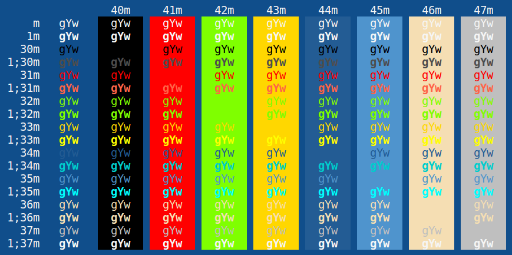
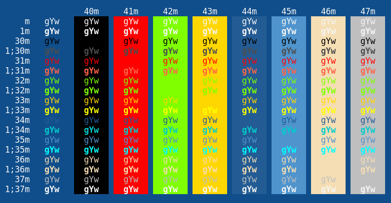
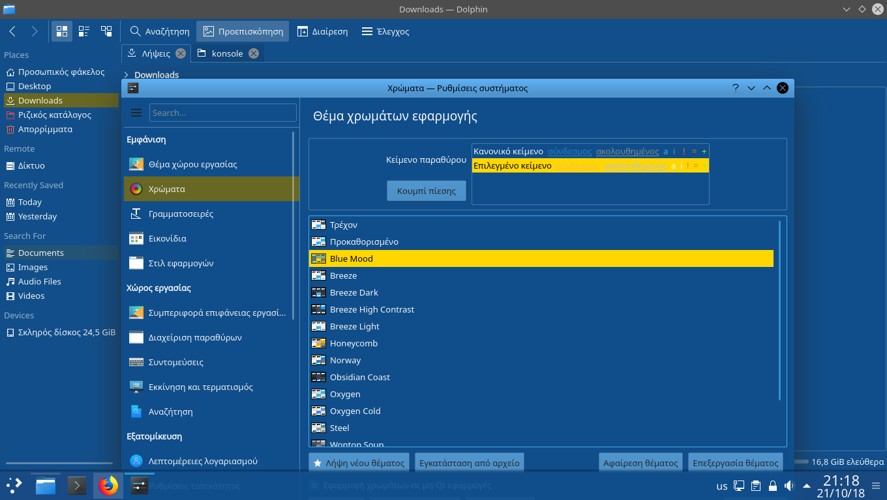
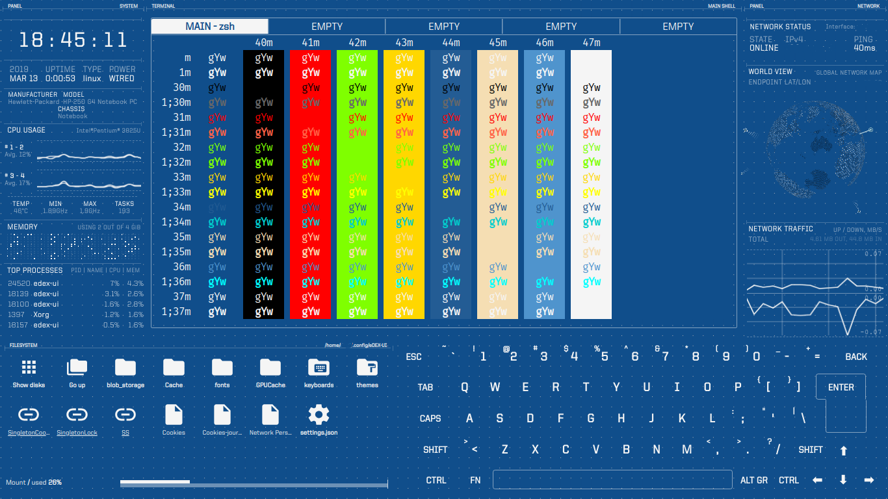

# Blue Mood everything!

This repository aims to aggregate links to all projects related to [emacs's Blue Mood theme](https://emacsthemes.com/themes/blue-mood-theme.html), so that they are easier to find for anyone interested.

## The original theme

The original colorscheme comes [from a theme for the emacs text editor](https://emacsthemes.com/themes/blue-mood-theme.html). For those using Emacs, it is included in the [replace-colorthemes repository](https://github.com/emacs-jp/replace-colorthemes), and can be installed via installing the MELPA package [color-theme-modern](http://melpa.org/#/color-theme-modern).

## My own implementations for other applications and interfaces
For installation and activation, see the instructions included in the repositories.

### Text editors

### [Vim](https://github.com/lmintmate/blue-mood-vim)

### [Gedit/pluma/xed](https://github.com/lmintmate/blue-mood-gedit)

### [micro](https://github.com/lmintmate/blue-mood-micro)

### [kate/kwrite](https://github.com/lmintmate/blue-mood-kate)

### [Sublime Text](https://github.com/lmintmate/blue-mood-sublime)

### Terminal emulators

### [Xresources](https://github.com/lmintmate/blue-mood-xresources)

### [konsole](https://github.com/lmintmate/blue-mood-konsole)

### [Gnome terminal and derivatives](https://gist.github.com/lmintmate/176a3c1b322726fbad7da6b1c60fe014) (using [Gogh](https://github.com/Mayccoll/Gogh))
(screenshot same as xresources and konsole)

### Interfaces

### [KDE Plasma 5](https://gitlab.com/lmintmate/blue-mood-kde-color-scheme)

### [eDEX UI](https://github.com/lmintmate/blue-mood-edex-ui)

